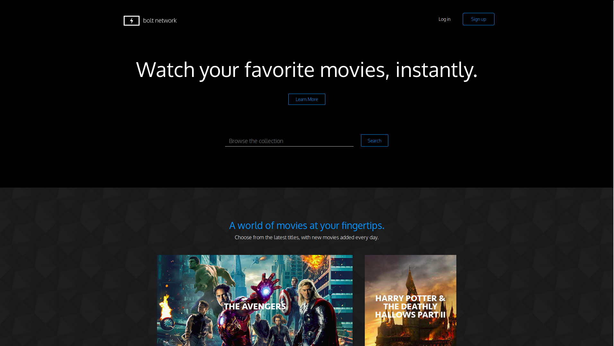

 This is a Front-end project build with HTML, CSS and Bootstrap. Feel free to use this template in your own project or to message me with you want some aditional information.

Here we have a good example of style's button, how to set up background images correctly, how to use bootstrap grid, paddings, margins and go on...

If you want to see this project online, you can find it in my <a href="http://codepen.io/LuKrebs/full/OpYzON/">CodePen profile</a>.

The image below give us a little taste about what this Front-end project looks like: 

